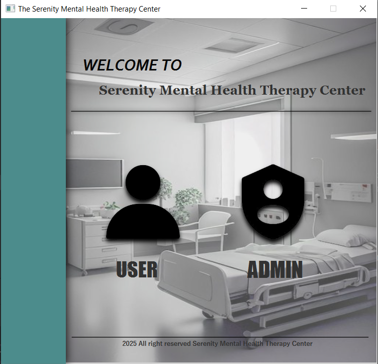
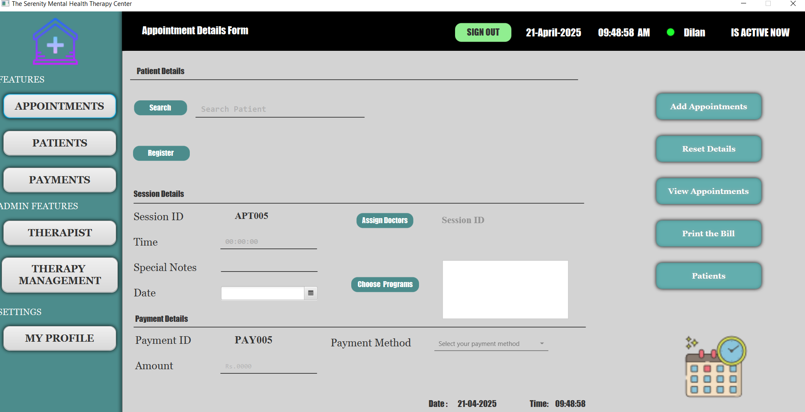
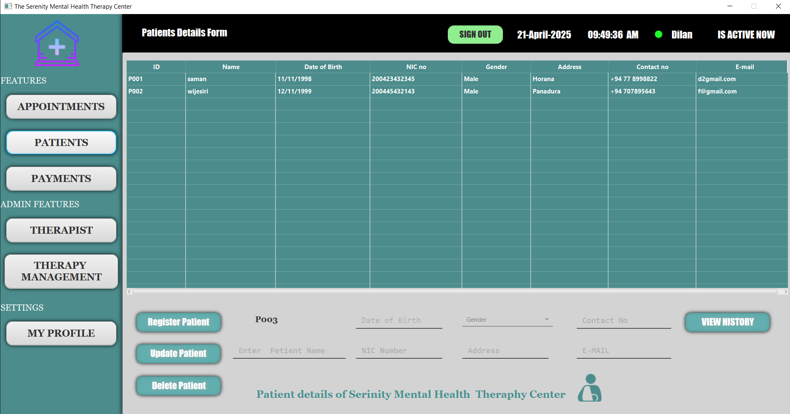
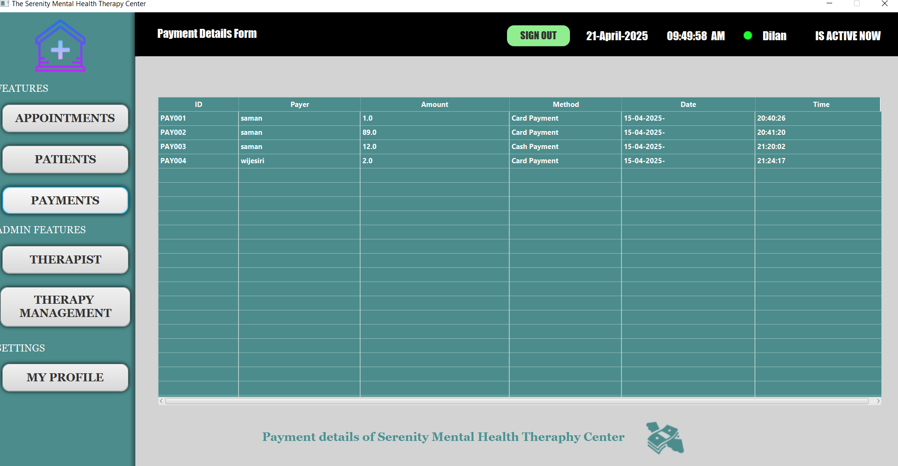
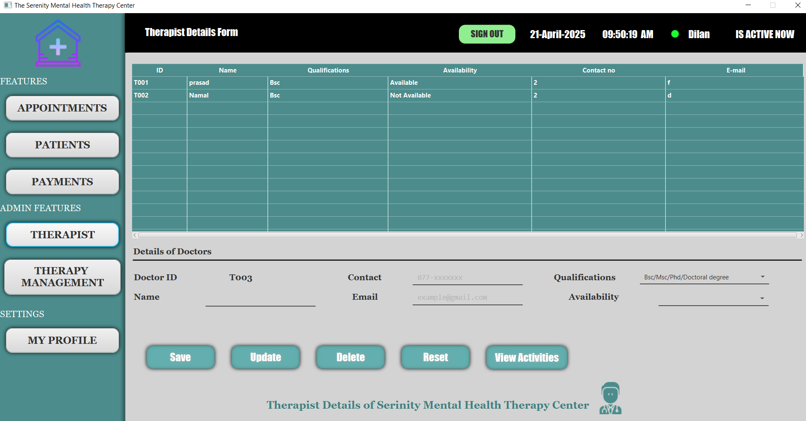
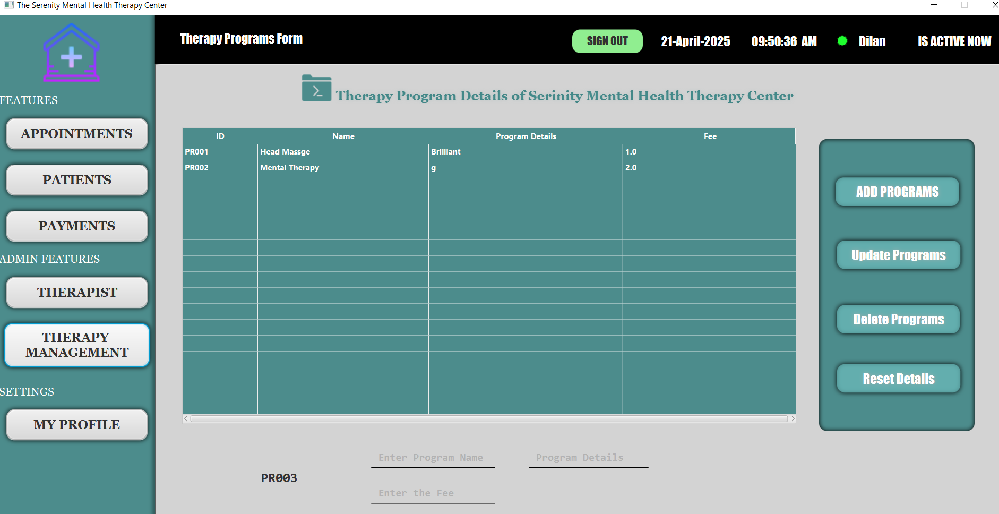
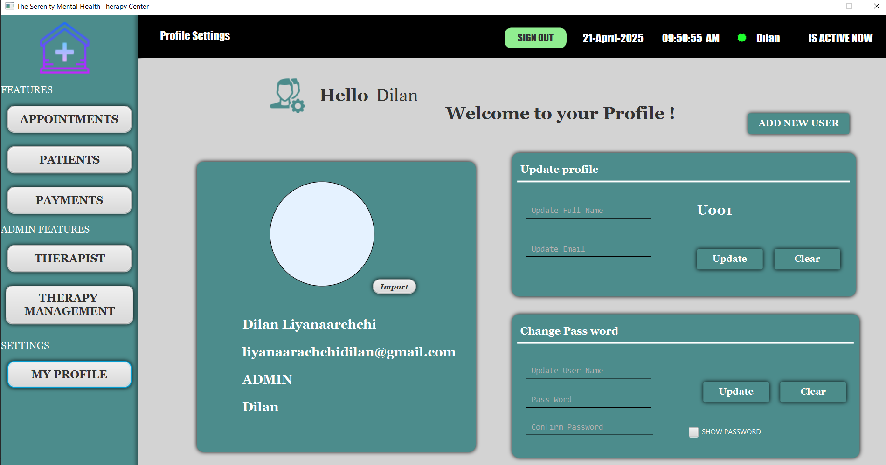

# Serenity Mental Health Therapy Center - Hibernate

Serenity Mental Health Therapy Center is a system designed to manage therapist activities, patient records, appointments, and statistics for a mental health clinic. It utilizes Hibernate for ORM-based database interaction.

## Project Overview

This project provides an efficient way for the Serenity Mental Health Therapy Center to manage therapist schedules, patient appointments, and treatment sessions. It includes features like:
- User Authentication and Role Management (Admin/User)
- Appointment Management
- Medical History Tracking
- Activity and Statistics Reports

## Technologies Used
- Java
- Hibernate (JPA)
- JavaFX
- MySQL Database
- JasperReports for Reporting
- Java Mail

## Features
- **User Authentication**: Secure login and password reset functionality.
- **Role-based Access Control**: Admin and user roles.
- **Appointment Management**: Manage patient appointments.
- **Medical History Management**: Track and update patient medical histories.
- **Therapist Activity Report**: Generate statistical reports on therapist activities using JasperReports.

### Prerequisites
- Java 8 or later
- MySQL Database
- Hibernate
- JasperReports Library
- Maven (for dependency management)

# Ui & UX 

### login Page

### Appointments

### Patients

### Payments

### Therapist

### Therapy Programs

### My Profile

